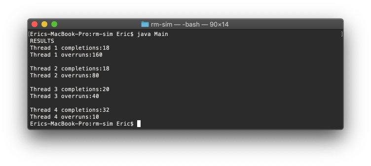

# rm-sim
Rate-Monotonic Scheduler simulation

### Link
- https://github.com/ereeq/rm-sim

## Task details
- Thread T1 has a period of 1 unit
- Thread T2 has a period of 2 units
- Thread T3 has a period of 4 units
- Thread T4 has a period of 16 units
- Each thread will execute the same doWork method but run it a
different number of times:
  - Thread T1 executes doWork 100 times
  - Thread T2 executes doWork 200 times
  - Thread T3 executes doWork 400 times
  - Thread T4 executes doWork 1600 times
  
## Scheduler details
- Scheduler has a major frame of 16 frames.
- as a Rate-monotonic scheduler, T1 has the highest priority, as T4, lowest.
- Scheduler needs to be woken up by a periodic source (signal/timer/etc) and it shall schedule the threads
- The program shall run for 10 periods and then terminate, but not before printing out how many times each thread ran
- The scheduler takes and releases semaphores so that each thread may run at its assigned time, according to its priority
- The thread then releases a flag only if the "doWork" function is completed, which marks the completion
- If the next thread must run and the flag is not up, semaphore is taken and overrun count is +1

## Results

## References
- https://docs.oracle.com/javase/7/docs/api/java/util/concurrent/ScheduledExecutorService.html 
- https://www.mkyong.com/java/java-scheduledexecutorservice-examples/